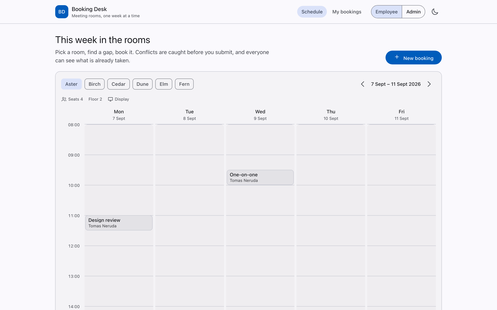
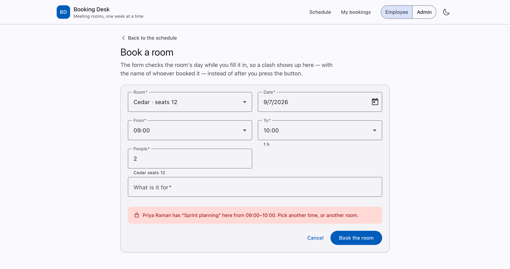
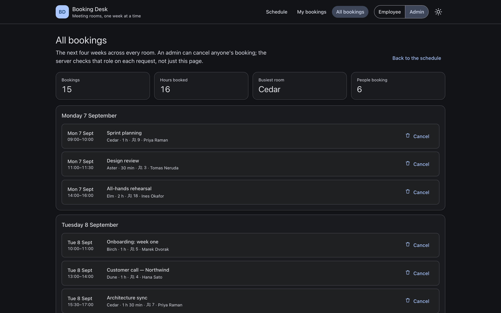

# Booking Desk

Meeting-room booking for a small office: a week of one room at a glance, a form
that catches conflicts while you type, and two roles that mean something —
employees manage their own bookings, admins manage everyone's.



## What it does

- **A week per room.** Pick a room, see its Monday-to-Friday grid, click any free
  half-hour to book it. Your own bookings are picked out from everyone else's,
  and a line marks the current time on today's column.
- **A form that argues back.** End before start, longer than four hours, more
  people than the room seats, a slot someone already took — each one is caught
  as you fill the form in, and a clash says *who* has the room and *when*, not
  just that it is busy.
- **Roles with teeth.** An employee sees and cancels their own bookings. An
  admin sees every booking in the next four weeks and can cancel any of them.
  The admin route is behind a guard, and the server checks the same rule again
  on every request — hiding a button is not authorisation.
- **The states everyone forgets.** First visit with nothing booked, loading, and
  a failed request all have a real screen with a way forward.



## The stack, and why

| | |
|---|---|
| Framework | Angular 20 — standalone components, no `NgModule` |
| Change detection | Zoneless (`provideZonelessChangeDetection`); `zone.js` is not in the bundle |
| State | Signals, with `rxResource` bridging RxJS to them |
| Forms | Typed `FormGroup` with cross-field validators |
| UI | Angular Material 20 (Material 3 theming) |
| Data | MSW — a service worker answers `/api/*`, the data lives in `localStorage` |
| Tests | Vitest + Testing Library, through Angular's `unit-test` builder |

## What is Angular here, and not just TypeScript

This is the part worth reading if you know the framework.

- **Dependency injection is the seam.** `BookingApi` is the only class that
  knows the API is HTTP. An `HttpInterceptor` attaches who is asking to every
  `/api` request, so authorisation is decided on the server side of the wire and
  the tests exercise the same path — they swap `HttpBackend`, not the API client.
- **Signals and RxJS meet in exactly two places.** I/O stays in RxJS;
  everything a template reads is a signal. `rxResource` turns a request into
  `value` / `isLoading` / `error` signals — which is precisely the loading and
  error states the UI has to render. The booking form's `valueChanges` is turned
  into a signal with `toSignal`, and a `computed` with a custom `equal` keeps
  typing in the "purpose" field from refetching the day's schedule.
- **Reactive forms, typed end to end.** `FormGroup<BookingFormControls>` is the
  only description of a booking form in the codebase; every validator reads it
  through `getRawValue()`. No `any`, no string lookups. The cross-field rules
  (`endAfterStart`, `maxDuration`, `withinCapacity`, `noOverlap`) live on the
  group, because they belong to the booking rather than to any one input, and
  they are rendered as one list under the form for the same reason.
- **A guard that explains itself.** `adminGuard` returns a `UrlTree` to a page
  that says which URL was refused and why, instead of bouncing to the home page.
- **Routing does the plumbing.** `withComponentInputBinding()` means clicking a
  free slot at 10:00 on Thursday arrives in the form as three signal inputs, with
  no manual `ActivatedRoute` subscription.

Two things surprised me, and both are in the code with a comment:
`position: sticky` inside a horizontally scrolling wrapper offsets against that
wrapper (the day headers ended up 68 px down inside the grid), and a lazy landing
route paints the shell around an empty page — the footer then jumps ~700 px when
the grid arrives. Making the landing route eager took CLS from 0.37 to 0.

## Data, without a backend

There is no server to run. MSW registers a service worker that answers
`/api/rooms`, `/api/bookings` and `DELETE /api/bookings/:id` with the same
status codes a real API would use: `409` for a clash (with the conflicting
booking attached), `422` for a booking that breaks a rule, `403` for cancelling
someone else's meeting. State lives in `localStorage`, so it survives a reload;
a `storage` listener keeps a second tab from showing a schedule that is no
longer true. Colleagues' meetings are re-seeded when the calendar moves to a new
week, and your own bookings are never touched by that.

Point `BookingApi` at a real host and nothing else in the app changes.



## Running it

```bash
npm install
npm start          # http://localhost:4200
```

```bash
npm run lint       # eslint, flat config
npm test           # vitest, 29 tests
npm run build      # production build into dist/booking-desk/browser
```

Node 20.19+ or 22.12+ (Angular 20's requirement).

## Tests

29 tests, in three layers, all against the real code:

- the API rules, driving the actual MSW handlers (conflicts, the four-hour
  limit, room capacity, who may cancel what);
- the cross-field validators;
- the scenario through the UI with Testing Library — book the slot that was
  clicked, find it in *My bookings*, cancel it through the confirmation dialog,
  and confirm someone else's booking never offers a Cancel button.

Both regressions I deliberately introduced while writing them (inverting the
"only the owner or an admin may cancel" check, and comparing the wrong field in
the overlap check) were caught by the suite.

CI runs lint → test → build on every push and pull request.

## Deploy

`vercel.json` is committed and the production build is verified: output
directory `dist/booking-desk/browser`, SPA rewrites for every path except the
service worker, and no-cache headers on `mockServiceWorker.js` so the mock API
updates with the app.

```bash
npx vercel deploy --prod
```

There is no public link yet — the repository is private. Everything above runs
locally from the production build; Lighthouse on it (desktop preset) reports
**100 performance / 100 accessibility / 100 best practices**.

## Known limits

- Five working days per week, 08:00–20:00, in the browser's own timezone. Dates
  are handled as local `YYYY-MM-DD` strings and times as minutes from midnight,
  so no timezone can move a meeting to the previous day — but a booking made in
  one timezone and read in another shows the same wall-clock time, which is the
  right answer for one office and the wrong one for several.
- One demo identity whose role you switch in the header; there is no sign-in.
- Recurring meetings, attendee invitations and room equipment requests are out
  of scope.
